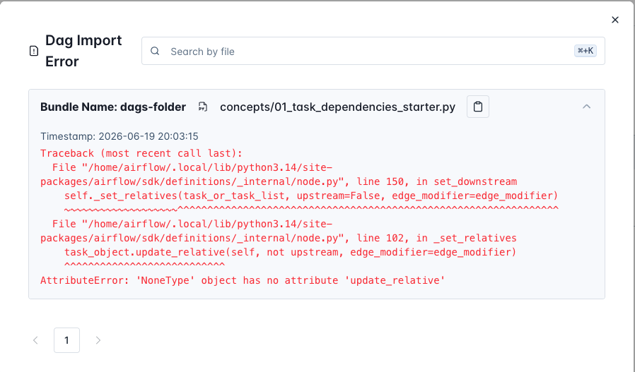

## Exercise 01 -- Task Dependencies

**What you will learn:** How to control task execution order with `>>`.

**Starter file:** `dagscode/concepts/01_task_dependencies_starter.py`

### The mechanism

Two `@task` functions inside a `@dag` have no guaranteed execution order unless you define one. The `>>` operator sets that order and draws the arrow in the Graph view.

### Setup

```bash
cp dagscode/concepts/01_task_dependencies_starter.py dags/concepts/
```

The DAG will appear in the Airflow UI within 30 seconds.

### Steps

1. Open `dags/concepts/01_task_dependencies_starter.py`
2. Trigger the DAG as-is. In Graph view, `greet` and `check_catalog` appear as disconnected nodes.
3. **TODO 1** -- Add `@task` to `check_catalog`:

```python
@task
def check_catalog():
    print("Catalog is ready.")
```

4. **TODO 2** -- Wire the tasks:

```python
greet_task >> check_catalog_task
```

5. Trigger again. Graph view shows the arrow from `greet` to `check_catalog`. Click each task to confirm they ran in order.

### What to look for in the UI

- **Graph view**: arrow appears between tasks after you add `>>`
- **Task start times**: `check_catalog` starts only after `greet` finishes

## Potential Errors

The DAG goes deactivated, fails to parse and on the Airflow Dags page you will see the error.



Hint: is everything decorated properly?
