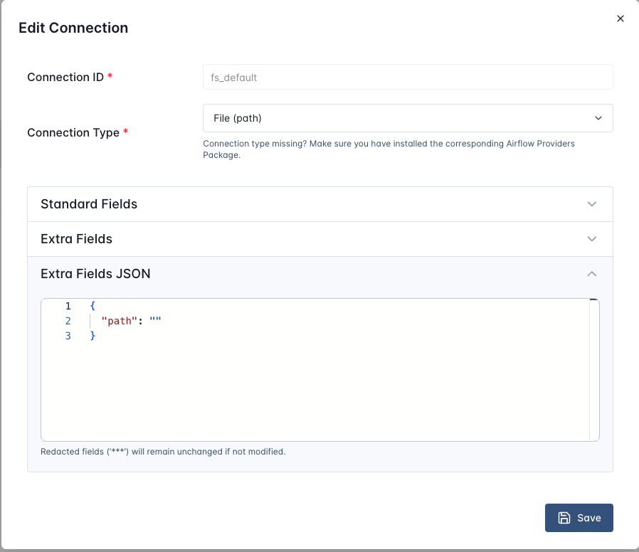

## Exercise 07 -- Sensors

**What you will learn:** How to pause a DAG until an external condition is true.

**Starter file:** `dagscode/concepts/07_sensor_starter.py`

### The mechanism

A Sensor is a special task that polls a condition on a schedule (`poke_interval`) instead of running once. When the condition becomes true, it succeeds and the next task runs.

| Mode | Behaviour | When to use |
|------|-----------|-------------|
| `poke` | Holds a worker slot the entire time it waits | Short waits (seconds to a few minutes); fast feedback |
| `reschedule` | Releases the worker slot between polls; wakes up and polls again after `poke_interval` | Long waits (minutes to hours); default choice in production |

Use `reschedule` unless you know the wait will be very short -- `poke` blocks a worker and starves other tasks if the wait drags on.

### Setup

Create the `fs_default` connection in the UI: **Admin > Connections > +**
- **Conn ID**: `fs_default`
- **Conn Type**: `File (path)`
- Leave the **Path** field empty

An empty path means the sensor uses your `filepath` argument as-is, which works because we pass an absolute path.



```bash
cp dagscode/concepts/07_sensor_starter.py dags/concepts/
```

The DAG will appear in the Airflow UI within 30 seconds.

### Steps

1. Open `dags/concepts/07_sensor_starter.py`
2. **TODO 1** -- Import `FileSensor`:

```python
from airflow.providers.standard.sensors.filesystem import FileSensor
```

3. **TODO 2** -- Create the sensor task:

```python
    wait_for_file = FileSensor(
        task_id="wait_for_file",
        filepath=str(REPO_ROOT / "data" / "sales" / "sensor_test.json"),
        poke_interval=10,
        timeout=120,
        mode="reschedule",
    )
```

4. **TODO 3** -- Wire it:

```python
    wait_for_file >> load_file()
```

5. Trigger the DAG. Open the Graph view -- `wait_for_file` will show in a light green "poking" state because `sensor_test.json` does not exist yet.
6. In a new terminal, create the file:

```bash
echo '{}' > data/sales/sensor_test.json
```

7. Within the next poke interval (10 seconds), the sensor succeeds and `load_file` runs.

### What to look for in the UI

- **Graph view**: sensor task stays light green while polling
- **Logs**: each poke attempt logged with "Poking: ..."
- After file created: sensor turns green, downstream task runs
